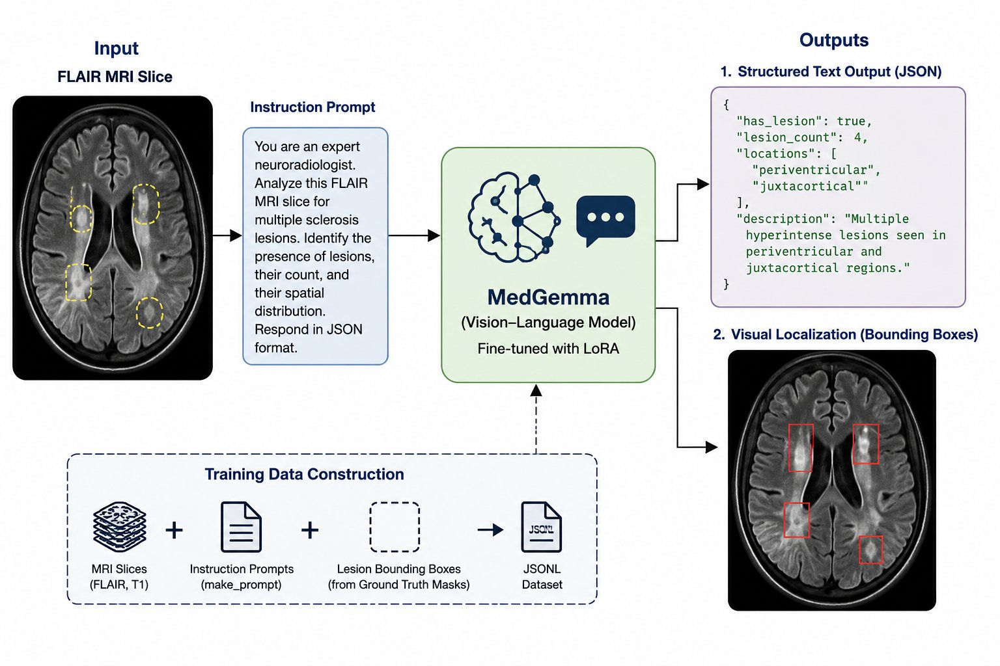

# MedGemma for Multiple Sclerosis Lesion Analysis

This repository contains an implementation and fine-tuning pipeline for **Google's MedGemma vision–language foundation model**, adapted for **Multiple Sclerosis (MS) lesion analysis in brain MRI**.

The model is explored as an alternative to traditional CNN-based segmentation networks, focusing on structured lesion interpretation and bounding box prediction from MRI slices.

---

## Overview

Multiple Sclerosis lesion segmentation is typically addressed using dense prediction models such as 3D CNNs and U-Nets. In contrast, this project investigates the use of a **vision–language foundation model (MedGemma)** for lesion analysis.

MedGemma combines:

- Vision encoding for medical images
- Natural language reasoning via a large language model
- Structured text generation capabilities

Instead of producing voxel-level segmentation masks, MedGemma generates:

- Lesion presence descriptions
- Lesion counts
- Spatial localization (bounding boxes in JSON format)

---

## Framework Overview

The figure below illustrates the MedGemma-based vision–language framework for MS lesion analysis. MRI slices are paired with task-specific prompts and processed by a LoRA fine-tuned MedGemma model to produce structured lesion predictions in JSON format, including bounding boxes and lesion attributes.

---

## Input Format

The model is trained on 2D MRI slices extracted from 3D volumes.
Each training sample consists of:

- MRI slice image (FLAIR or T1-weighted)
- Instruction prompt (template-based)
- Ground-truth bounding boxes derived from segmentation masks

---

## Dataset

MedGemma is trained on a subset of 20 MS patients from publicly available datasets.

- MRI modalities: FLAIR, T1-weighted
- Preprocessed data: co-registered, bias-corrected
- Labels: segmentation masks converted to bounding boxes
- Format: JSONL (image–text pairs)

---

## Training

The model is fine-tuned using:

- Low-Rank Adaptation (LoRA)
- Parameter-efficient training strategy
- Instruction tuning on MRI slice–prompt pairs

Key characteristics:

- 2D slice-based training (not volumetric)
- Supervised learning using bounding box targets
- Structured JSON output supervision
- Small dataset (~20 patients)

---

## Evaluation

The model is evaluated using both quantitative and qualitative metrics.

Quantitative metrics:

- Dice Similarity Coefficient (after bbox → mask conversion)
- Precision
- Recall
- Balanced Accuracy
- mIoU (mean Intersection over Union)

Qualitative evaluation:

- Ability to generate coherent lesion descriptions
- Spatial reasoning in medical context
- Consistency of structured JSON outputs

---

---
## Results

MedGemma (LoRA fine-tuned) results after bounding box → mask conversion:

| Metric            | Score |
|-------------------|-------|
| Dice              | 0.438 |
| Precision         | 0.042 |
| Recall            | 0.064 |
| Balanced Accuracy | 0.530 |

Key observations:

- MedGemma achieves a reasonable Dice score after bounding box conversion
- Very low precision and recall, due to the coarse bounding box approximation of lesion regions
- Performance is limited by the small dataset (~20 patients) and the mismatch between the bounding box task and dense segmentation

---

